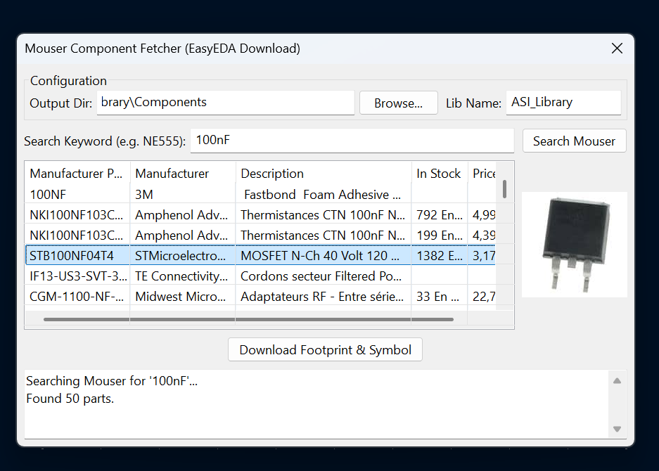

# KiCad Mouser & EasyEDA Component Fetcher Plugin

A KiCad Action Plugin (for PCBnew) that allows you to search for components on **Mouser**, view their real-time stock, pricing, and product images, and then automatically download their CAD models (Symbol, Footprint, and 3D Model) from **EasyEDA/LCSC** into your local KiCad library.



## Features
- 🔍 Search Mouser's catalog by keyword or part number.
- 📦 View real-time stock and pricing directly inside KiCad.
- 🖼️ View component images natively.
- 🚀 One-click download of Symbols, Footprints, and 3D models via EasyEDA.
- 📚 Automatically appends to your selected KiCad library (no more loose files!).

## Requirements
- KiCad 7.0, 8.0, 9.0, or 10.0
- A [Mouser Search API Key](https://www.mouser.com/api-hub/) (Free)
- Python packages: `requests` and `easyeda2kicad`

## Installation

### 1. Download the Plugin
Clone or download this repository into your KiCad plugins folder:
- **Windows:** `Documents\KiCad\<version>\scripting\plugins\Plugin_Kicad`
- **Linux:** `~/.local/share/kicad/<version>/scripting/plugins/Plugin_Kicad`
- **macOS:** `~/Library/Application Support/kicad/scripting/plugins/Plugin_Kicad`

*(Note: The folder name must not contain spaces, e.g., `Plugin_Kicad` is fine).*

### 2. Install Python Dependencies
You must install the required Python packages into **KiCad's Python environment** (not your system Python).

**On Windows:**
Open the **KiCad Command Prompt** from your Start menu and type:
```bash
pip install requests easyeda2kicad
```

**On Linux / macOS:**
Use the system package manager or pip depending on how KiCad was installed.

Alternatively, you can open the **Scripting Console** inside KiCad's PCB Editor and run:
```python
import subprocess, sys, os
python_exe = os.path.join(os.path.dirname(sys.executable), "python.exe")
if not os.path.exists(python_exe): python_exe = "python"
subprocess.run([python_exe, "-m", "pip", "install", "requests", "easyeda2kicad"])
```

### 3. Setup your Mouser API Key
To protect your API key, it is read from a local configuration file.
1. Rename `config_template.json` to `config.json`.
2. Open `config.json` and paste your Mouser Search API Key:
```json
{
    "mouser_api_key": "YOUR_MOUSER_API_KEY_HERE",
    "output_dir": "",
    "lib_name": "EasyEDA_Mouser"
}
```

## Usage
1. Open KiCad PCB Editor (`Pcbnew`).
2. Click the **Mouser Component Fetcher** icon in the toolbar (or via `Tools > External Plugins`).
3. Choose an output directory and a library name (e.g., `MyComponents`).
4. Search for a part (e.g., `NE555P`).
5. Select the part and click **Download Footprint & Symbol**.

The plugin will generate a `.kicad_sym` file and a `.pretty` folder.
To use the downloaded components, go to KiCad's **Preferences > Manage Symbol Libraries** (and Footprint Libraries) and add them to your Global Libraries. Any future downloads with the same library name will be appended automatically!

---
*Disclaimer: This plugin is not affiliated with Mouser Electronics or EasyEDA. It uses the excellent [easyeda2kicad](https://github.com/uPesy/easyeda2kicad) script under the hood.*
